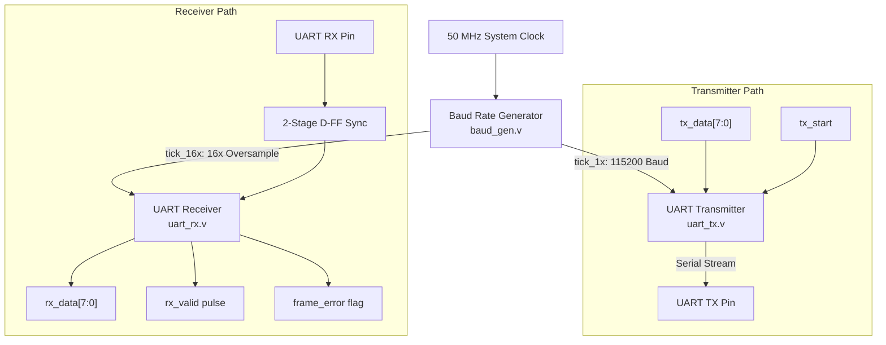
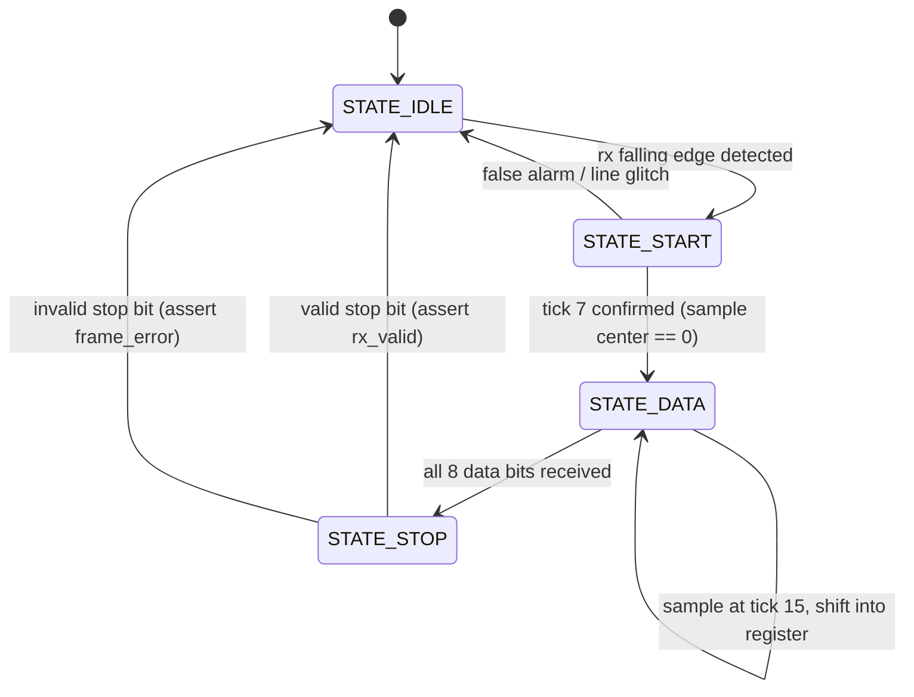

# Configurable UART Protocol Controller with Baud Generator

A full-duplex, synthesizable Universal Asynchronous Receiver-Transmitter (UART) protocol controller implemented in Verilog HDL.

---

## Block Architecture



---

## Receiver (RX) 16x Oversampling State Machine



---

## Key Hardware Design Features

1. **Configurable Baud Rate Generation:** Implements an integer divider counter generating 16$\times$ oversampling ticks from a $50\text{ MHz}$ master clock:
   $$\text{Divider}_{16\times} = \frac{f_{\text{system\_clk}}}{\text{Baud Rate} \times 16} = \frac{50,000,000}{115200 \times 16} \approx 27$$
2. **Noise-Immune 16$\times$ Oversampling:** Rejects transient line glitches by validating the start bit at the exact middle of the bit period (tick 7), and samples each data bit at tick 15 to maximize eye-diagram noise margins.
3. **Framing & Error Detection:** Validates stop bit framing and asserts `frame_error` upon protocol violations.
4. **Hardware Loopback Test Mode:** Enables built-in automated loopback testing for self-checking verification.

---

## Directory Structure

```
├── uart_top.v    # Top-level module integrating TX, RX, and Baud Gen
├── baud_gen.v    # Parameterized frequency divider
├── uart_tx.v     # 8-N-1 Serial transmitter FSM
├── uart_rx.v     # 16x oversampled serial receiver FSM
└── tb_uart.v     # Automated self-checking loopback testbench
```

---

## Simulation & Verification

The controller is compiled and tested with **Icarus Verilog**:

```bash
# Compile and run simulation
iverilog -o sim_uart tb_uart.v uart_top.v baud_gen.v uart_tx.v uart_rx.v
vvp sim_uart
```

### Simulation Output
```text
------------------------------------------------------------
   STARTING UART CONTROLLER VERIFICATION TESTBENCH          
------------------------------------------------------------
>>> Testing Loopback Transmissions across 4 distinct data patterns...
[PASS] Byte successfully transmitted and received: 0xa5
[PASS] Byte successfully transmitted and received: 0x3c
[PASS] Byte successfully transmitted and received: 0xff
[PASS] Byte successfully transmitted and received: 0x00
------------------------------------------------------------
   ALL UART CONTROLLER TESTS PASSED WITH ZERO ERRORS!       
------------------------------------------------------------
```

Waveforms can be inspected via GTKWave:
```bash
gtkwave uart.vcd
```
